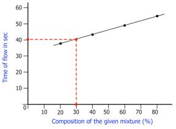

## Theory 

<iframe width="560" height="315" src="https://www.youtube.com/embed/Gs3gfwG9a7k" frameborder="0" allow="autoplay; encrypted-media" allowfullscreen></iframe>

The internal property of a fluid for its resistance to flow is known as viscosity. In 1844 Hagen–Poiseuille did their work concerning the interpretation that liquid flow through tubes and he proposed an equation for viscosity of liquids. This equation is called Poiseuille’s equation.

$$\eta=\frac{\pi r^4Pt}{8VL}...........(1)$$

  

 

  Where &eta; is called the viscosity coefficient, <i>t</i> is the time of flow of liquid, <i>V</i> is the volume of the liquid, <i>P</i> is the hydrostatic pressure, and <i>L</i> is the distance travelled by the liquid during time <i>t</i>. In honour of Hagen–Poiseuille, the unit of viscosity is called the <b>Poise (P)</b>. The official SI unit for absolute viscosity is <b>kg/m·s</b> (or Pascal-seconds, <b>Pa·s</b>).

  Viscosity can be measured using a viscometer. The different types of viscometer are as follows:

<ul>
  <li>Ostwald viscometer</li>
  <li>Falling sphere viscometer</li>
  <li>Falling piston viscometer</li>
  <li>Oscillating piston viscometer</li>
  <li>Vibrational viscometers</li>
  <li>Rotational viscometers</li>
  <li>Bubble viscometer</li>
</ul>

  <b>Ostwald viscometer</b> is a commonly used viscometer, which consists of a U-shaped glass tube held vertically. For more accurate measurements, it is held in a controlled temperature bath. It is also known as a glass capillary viscometer. A liquid is allowed to flow through its capillary tube between two etched marks, and the time of flow of the liquid is measured using a stopwatch.

In an Ostwald viscometer the measured distance the liquid travels, L, will be always a constant; the radius, r will always be a constant; and by procedure the volume of liquid, V will also be constant. Equation (1) can then be simplified to: 

$$\eta=KPt...........(2)$$

Where K is a constant and 
$$K=\frac{\pi r^4}{8VL}$$

The hydrostatic pressure is P proportional to the density of the fluid being measured. In our experiment we will be measuring the mass of equal volumes of liquid so that the viscosity will be proportional to the masses measured. Therefore we have the relation:

$$\eta \propto Kmt.............(3)$$

Where K and t are defined above and m is the mass of the liquid.
For finding the viscosity of liquids it is important to calibrate the viscometer using a reference liquid. Water is a commonly used reference liquid. The viscosity of water at 30.0 °C is 0.8007 centipoise (cP). Knowing the values for the reference liquid and relation (3), we get:

$$\frac{\eta}{\eta_r}=\frac{mt}{m_rt_r}..............(4)$$

  Where: &eta;r is the viscosity coefficient of the reference sample (water), <i>mr</i> is the mass of the reference sample, and <i>tr</i> is the time flow of the reference sample. Note that <i>K</i> cancels out. The other variables are the viscosity coefficient, mass, and time flow of the sample respectively.

  With an Ostwald viscometer, we can measure the time flow of a liquid (mass can be measured using standard laboratory procedures, e.g., a relative density bottle and a scale) and determine its viscosity by solving equation (4) for &eta;.

$$\eta=mt \left( \frac{\eta_r}{m_rt_r} \right)...........(5)$$

### Temperature Dependence of Viscosity
 

In 1889 Arrhenius expressed an equation for temperature dependent chemical reaction rates. Since then, many temperature dependent chemical and physical processes have been found to behave in accordance with Arrhenius-like equations. For the viscosity of many liquids, the viscosity decreases as the temperature increases in accordance with the following equation:

$$\eta =Ae^{(E_n/RT)}...........(6)$$

  Where <i>A</i> is a constant known as the Arrhenius constant, <i>E&eta;</i> is the activation energy for flow, <i>R</i> is the ideal gas constant, and <i>T</i> is the temperature of the liquid using an absolute scale (almost always K — the units of <i>E&eta;</i>, <i>R</i> and <i>T</i> should be chosen so that the ratio is dimensionless. <i>A</i> will have the same dimensions as &eta;, in our case cP). A plot of &eta; vs. 1/<i>T</i> should be linear and have a slope equal to <i>E&eta;</i> / <i>R</i> if the liquid’s viscosity exhibits Arrhenius-like behaviour.

<h3>Determination of Unknown Composition</h3>

  Using an Ostwald viscometer, we can also calculate the unknown composition of a mixture. The viscosities of mixtures of different known compositions are measured and a graph is plotted with viscosity against the compositions of the different mixtures. From the graph, the composition of the unknown mixture corresponding to the viscosity can be determined.

div style="display: block; margin-left: auto; margin-right: auto; text-align: center; width: fit-content;">

